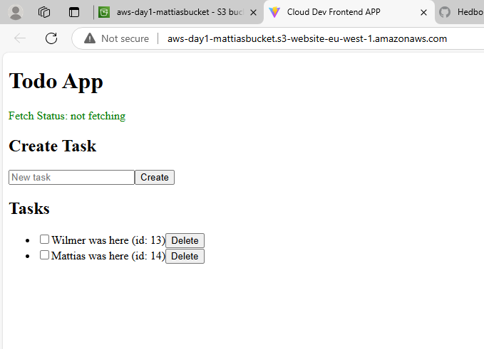

# Screenshots



# JAVA Cloud AWS - Day One

## Learning Objectives

- Understand how to deploy an API to AWS Elastic Beanstalk
- Understand how to spin up an AWS PostgreSQL instance
- Host frontend static files on AWS S3

## Instructions

1. Fork this repository.
2. Clone your fork to your machine.

# Core Activity

## Set Up Amazon RDS for PostgreSQL
### Steps
1. **Create an RDS Instance:**
   - Open the AWS Management Console and navigate to the RDS service.
   - Click "Create database."
   - Choose the "Standard Create" option.
   - Select the PostgreSQL engine.
   - Configure the DB instance settings (DB instance identifier, master username, password).
   - Choose the instance type and allocated storage.
   - Click "Create database."

2. **Configure Database Connectivity:**
   - After the database is created, navigate to the "Connectivity & security" tab.
   - Note the "Endpoint" and "Port."
   - Configure the security group to allow access from your Elastic Beanstalk environment.

3. **Build API and Compress**
   - Open the Backend Projectin IntelliJ.
   - Add the connection details to `application.yml`
   - Change the Port number in `application.yml` to `5000`
   - Initially test with a Neon DB then gradually move to use the RDS Database
   - Run the command to build a Jar file as we did when building for Docker
   - In the next steps when it asks for a local file to upload, use the Jar file you created  

4. **Open the AWS Management Console:**

   - Navigate to the Elastic Beanstalk service.
   - Click "Create Application."
   - Enter the application name (e.g., aws-java-day-1-{studentName}-api).
   - Description is Optional.
   - Click Create

5. **Create and Environment for you Application**
   - Click on **Create new Environment**.
   - Follow the steps **EXACTLY**.
      1. ### Configure environment
         - Environment tier choose **Web Server environment**.
         - Platform choose **Java**.
         - Application Code pick **Upload your code**.
            - Then choose your local compress file.
            - Add your own version Label (e.g. v1, v1.1 etc).
         - Preset pick **High availability**
         - Click on **Next**
      2. ### Configure service access
         - Leave everything as it is.
         - No Changes to be made. 
         - Click on **Skip to review**
      3. ### Edit Step 4 
         - Root volume type **General Purpose 3(SSD)**.
         - Instance types remove **t3.small**. (Only **t3.micro** should be left.)
         - Click on **Skip to review**
   - Click on **Submit**

## Deploy Frontend UI
### Prerequisites
   - AWS Account
   - Frontend application built locally (e.g., React app)

### Steps
1. **Create an S3 Bucket:**
   - Open the AWS Management Console and navigate to the S3 service.
   - Click on the "Create bucket" button.
   - Enter a unique bucket name.
   - Choose the AWS region where you want to create the bucket.
   - Leave the default settings for the remaining options, or configure as needed.
   - Click "Create bucket".

2. **Upload Frontend Files:**
   - Build your frontend application locally (assuming it’s a React app):
```bash
npm run build
```
   - In the AWS Management Console, navigate to the S3 bucket you created.
   - Click on the "Upload" button.
   - Click "Add files" and select the files from the build folder.
   - Click "Upload" to upload the files to the S3 bucket.

3. **Configure Static Website Hosting:**
   - In the AWS Management Console, navigate to your S3 bucket.
   - Go to the "Properties" tab.
   - Scroll down to the "Static website hosting" section.
   - Click "Edit".
   - Enable static website hosting.
   - Set the index document name (e.g., index.html).
   - (Optional) Set the error document name if needed (e.g., 404.html).
   - Click "Save changes".

4. **Set Bucket Policy for Public Access:**
   - Navigate to the "Permissions" tab of your S3 bucket.
   - Click on "Bucket Policy".
   - Add the following policy to allow public read access:
json
```json
{
  "Version": "2012-10-17",
  "Statement": [
    {
      "Sid": "PublicReadGetObject",
      "Effect": "Allow",
      "Principal": "*",
      "Action": "s3:GetObject",
      "Resource": "arn:aws:s3:::your-bucket-name/*"
    }
  ]
}
```
   - Replace your-bucket-name with the name of your S3 bucket.
   - Click "Save".

1. **Access the Static Site:**
   - After configuring static website hosting, note the "Bucket website endpoint" URL provided in the static website hosting section.
